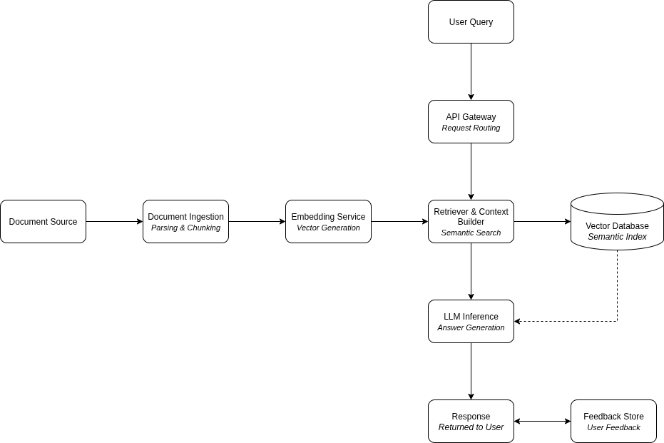

# High Level Architecture

                            Rough Initial Flowchart

## Core Components

### 1. API Gateway
- Entry point for all use user requests
- Responsible for request validation, routing and response formatting

### 2. Document Ingestion Pipeline
- Handles ingestion of raw documents
- Performs
    - Parsing
    - Chunking (optionally with configurable size and overlap)

### 3. Embedding Service
- Converts text chunks into dense vector representations

### 4. Vector Database
- Stores embeddings and associated metadata
- Enables fast semantic similarity search
- Backed by persistent volume 

### 5. Retrieval and Context Builder
- Executes similarity search against the vector database
- Applies ranking and filering strategies
- Constructs a context window that fits within model token limits

### 6. LLM Inference Service
- Generates final responses using retrieved context
- Uses prompt template to enforce grounded answers

### 7. Caching Layer
- Caches frequent queries and responses
- Reduces latency and inference cost

### 8. Feedback Collection
- Captures explicit user feedback on responses
- Stores queries, retrieved context, model output and feedback labels
- Serves as the foundation for dataset generation and model improvement

## Deployment Architecture

### Control-Plane Node
#### Acer Predator Laptop
- Primary Role
    - Cluster orchestration only

### Worker Node - High Performance Compute and Storage
#### HP Z440 Workstation (x86_64, ~200 GB Free Storage)
- Primary Role
    - Low-latency LLM inference
    - Model routing (and A/B testing)
    - Training and evaluation jobs
    - Primary persistent storage provider

### Worker Node - ARM64 Semantic Processing
#### Raspberry Pi 5 (ARM64, 128GB M.2 SATA SSD)
- Primary Role
    - Embedding generation
    - Retieval service
    - Redis caching
    - Background ingestion workers